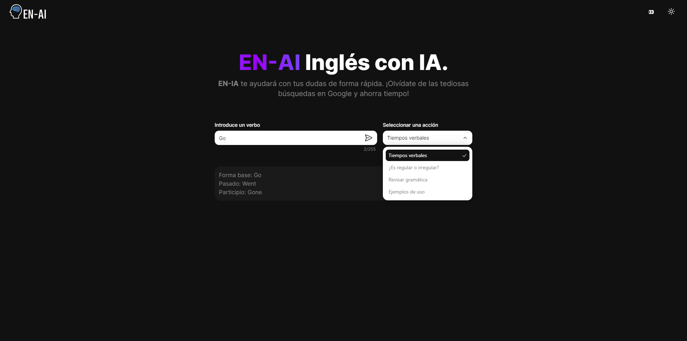
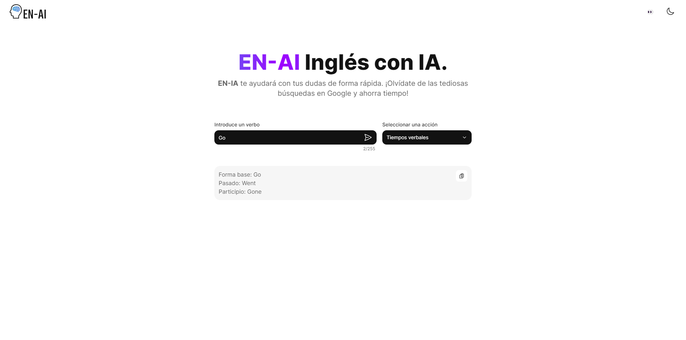

# EN-AI
Podrás resolver dudas básicas en inglés de forma rápida usando IA.

## Proceso de instalación
1. Ejecutar el comando ```pnpm install``` en la raíz del proyecto para agregar las dependencias necesarias
2. Ejecutar ```pnpm dev``` para levantar el proyecto

## Screenshots



## Enlaces
Creado por: [Rafael Sequeira Sandoval](https://www.rafael-sequeira-sandoval.dev/)